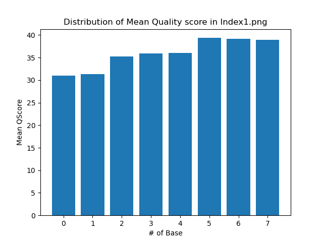
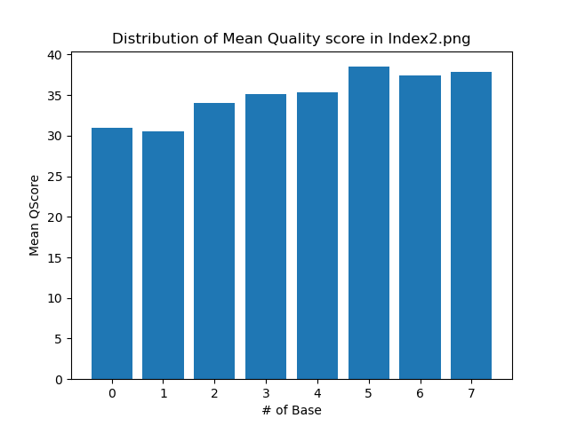
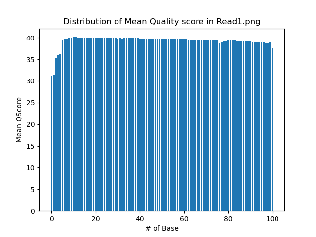
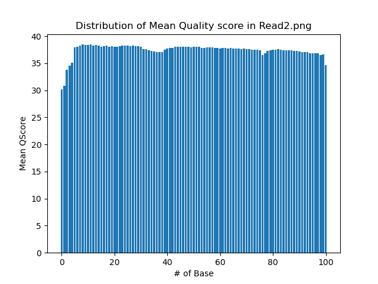

# Assignment the First

## Part 1
1. Be sure to upload your Python script. Provide a link to it here:

[python script](first.py)

Assessing read length:
```zcat /projects/bgmp/shared/2017_sequencing/$file | head -2 | grep -v "^@" | wc -c ```
(output -1 since there is new line characters)

| File name | label | Read length | Phred encoding |
|---|---|---|---|
| 1294_S1_L008_R1_001.fastq.gz | read1 | 101 | phred 33 |
| 1294_S1_L008_R2_001.fastq.gz | index1 | 8 | phred 33 |
| 1294_S1_L008_R3_001.fastq.gz | index2 | 8 | phred 33 |
| 1294_S1_L008_R4_001.fastq.gz | read2 | 101 | phred 33 |

2. Per-base NT distribution

A. Use markdown to insert your 4 histograms here.







B. Setting the quality score cut off at 30 for the reads and indexes. Using the histogram of mean q-score distribution, we observe the lowest mean qscore of approximately 30 for all index and read files. At the base position where Q = 30, setting quality score cut off lower than 30 would allow inclusion of some bad quality nucleotide. However, setting it higher might exclude acceptable nucleotide at these base positions. Setting it at 30 allows proper quality filtering. Additionall Q score of 30 translates to a base call accuracy of 99.9%. For the purpose of Demultiplexing, this quality filtering would allow us to retrieve high quality full sequences. 

C. Number of indexes containing undertermined base call:

```zcat /projects/bgmp/shared/2017_sequencing/1294_S1_L008_R2_001.fastq.gz | sed -n 2~4p | grep -E "N" | wc -l``` 
    
index1 = 3976613

```zcat /projects/bgmp/shared/2017_sequencing/1294_S1_L008_R3_001.fastq.gz | sed -n 2~4p | grep -E "N" | wc -l```  
    
index2 = 3328051
    
## Part 2
1. Define the problem

- Indexes are stored in separate files (R2 and R3 with R3 containing the reverse complemented index)
- As we iterate through each record for Demultiplexing, we want to keep the index sequence as part of the record to refer to, so we want to attach these indexes to the header of each record
- To demultiplex:
a. We want to make sure the both indexes (which matches each record) is the same for both reads
b. Trim indexes that are not supposed to be there (index hopping) - which are the indexes from different sources and does not match the current record
c. Elliminate indexes that are not known

2. Describe output
3. Upload your [4 input FASTQ files](../TEST-input_FASTQ) and your [>=6 expected output FASTQ files](../TEST-output_FASTQ).
4. Pseudocode
5. High level functions. For each function, be sure to include:
    1. Description/doc string
    2. Function headers (name and parameters)
    3. Test examples for individual functions
    4. Return statement
